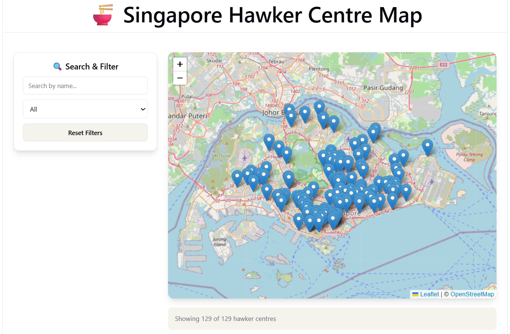
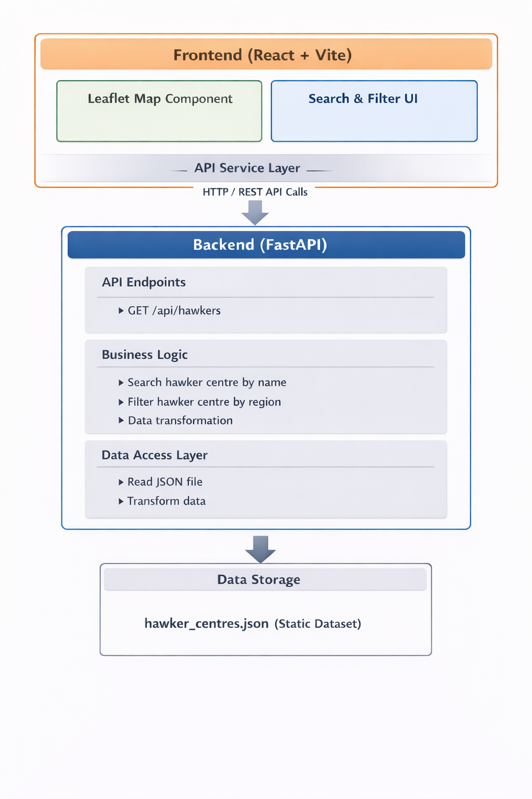

# 🍜 Singapore Hawker Centre Map

An interactive web application that visualizes Singapore hawker centres on an interactive map, allowing users to search, filter, and explore hawker centres across different regions of Singapore.

## Overview

This application provides an intuitive interface for exploring Singapore's hawker centre landscape. Users can view hawker centres on an interactive map, search by name, filter by region.

<div style="text-align: center;">
  
</div>

## Features

**Map Interactions**
- **Zoom & Pan**: Full Leaflet map controls for exploring Singapore at any zoom level
- **Click Popups**: Click any marker to display detailed hawker centre information
- **Auto-Zoom**: Map automatically zooms to show filtered or selected results

**Search & Filter**
- **Search by Name**: Real-time search that filters hawker centres
- **Filter by Region**: Dropdown to show only specific regions (Central, North, East, West, North-East)
- **Combined Filters**: Search and region filters work together to narrow results
- **Reset Filters**: One-click button to clear all filters and show all hawker centres

**Hawker Centre Information**
- **Interactive Map**: Leaflet-powered map with all hawker centres as clickable markers
- **Comprehensive Details**: Each popup displays:
  - Hawker centre name
  - Full address
  - Postal code
  - Region classification
  - Number of stalls

**Visual Feedback**
- **Stats Count**: Stats bar shows how many hawker centres are currently displayed

## Architecture

<div style="text-align: center;">
  
</div>

## Tech Stack

### Frontend
- **React**: UI framework
- **Vite**: Build tool and dev server
- **Leaflet + React-Leaflet**: Interactive maps

### Backend
- **Python 3.11+**: Runtime environment
- **FastAPI**: REST API framework
- **Uvicorn**: ASGI server

### Data
- **JSON**: Data storage

### Testing
- **Pytest**: Backend testing
- **Vitest + Testing Library**: Frontend testing

## Getting Started

### Prerequisites

- **Node.js** (v18 or higher) - [Download](https://nodejs.org/)
- **npm** (v9 or higher) - Comes with Node.js
- **Python** (v3.11 or higher) - [Download](https://www.python.org/downloads/)
- **Git** (optional) - [Download](https://git-scm.com/)

### Installation

#### 1. Clone the Repository

```bash
git clone https://github.com/carineang/hawker-centre-map.git
cd hawker-centre-map
```

#### 2. Backend Setup
```
cd backend

# Install dependencies
pip install -r requirements.txt
pip install --upgrade fastapi starlette

# To start
uvicorn app.main:app --reload

# To stop
Ctrl + c
```

#### 3. Frontend Setup (on another terminal)
```
cd frontend

# Install dependencies
npm install

# To start
npm run dev

# To stop
Ctrl + c
```

### Note:
#### To access the application
- Frontend: http://localhost:5173
- Backend API: http://localhost:8000
- API Documentation: http://localhost:8000/docs

## Testing

### Backend Tests

```
cd backend

# Run all tests
py -m pytest -v

# Run specific test file
py -m pytest tests/test_api.py -v
py -m pytest tests/test_data.py -v
py -m pytest tests/test_models.py -v
```

### Frontend Tests

```
cd frontend

# Install test dependencies
npm install --save-dev vitest @testing-library/react @testing-library/jest-dom @testing-library/user-event jsdom

# Run all tests
npm run test:run

# Run specific test file
npm run test:run -- src/tests/api.test.js
npm run test:run -- src/tests/HawkerMap.test.jsx
```

## Project Structure
```
hawker-centre-map/
├── backend/
│   ├── app/
│   │   ├── main.py                    # FastAPI application
│   │   └── models/
│   │       ├── __init__.py
│   │       └── hawker_centre.py       # Data models
│   ├── tests/
│   │   ├── conftest.py                # Test fixtures
│   │   ├── test_api.py                # API endpoint tests
│   │   ├── test_data.py               # Data validation tests
│   │   └── test_models.py             # Model tests
│   └── requirements.txt               # Python dependencies
├── data/
│   ├── hawker_centres.json            # Hawker centre data
│   └── transform_geojson.py           # Convert geojson to json
├── frontend/
│   ├── src/
│   │   ├── components/
│   │   │   └── HawkerMap.jsx          # Leaflet map component
│   │   ├── services/
│   │   │   └── api.js                 # API service layer
│   │   ├── test/
│   │   │   └── setup.js               # Test configuration
│   │   ├── tests/
│   │   │   ├── api.test.js            # API service tests
│   │   │   └── HawkerMap.test.jsx     # HawkerMap component tests
│   │   ├── App.jsx                    # Main application component
│   │   ├── main.jsx                   # Application entry point
│   │   └── index.css                  # Global styles
│   ├── public/
│   ├── index.html
│   ├── package-lock.json
│   ├── package.json
│   └── vite.config.js
├── .gitignore
└── README.md
```

## Assumptions

- **Data Accuracy**: The dataset from [Data.gov.sg](https://data.gov.sg) is assumed to be accurate and up-to-date. 
- **Region Classification**: Region classification is based on postal code prefixes. If hawker centre is located in the "South" region, it is classified as "Central" due to proximity to the CBD (Central Business District) area. This ensures that centrally located hawker centres are grouped together for better user experience.
- **Geographic Bounds**: All coordinates are assumed to be within Singapore (latitude: 1.2-1.5, longitude: 103.6-104.1).
- **Data Consistency**: The JSON data file is assumed to contain all required fields (`id`, `name`, `address`, `postal_code`, `region`,`latitude`, `longitude`, `total_stalls`).

## Design Decisions

1. **No Database - JSON File Storage**
   - **Decision**: Store data in a static JSON file instead of a database.
   - **Rationale**: The dataset is small (~100 records) and changes infrequently. A JSON file simplifies deployment and eliminates database setup requirements.
   - **Trade-off**: Real-time updates require redeployment; data must be manually refreshed.

2. **Frontend-First Approach**
   - **Decision**: Built search and filter logic in the frontend.
   - **Rationale**: Reduces API complexity and server load. The dataset is small enough to filter efficiently in the browser.
   - **Trade-off**: Initial load includes all data; not suitable for very large datasets.

3. **Debounced Search**
   - **Decision**: 500ms debounce delay on search input.
   - **Rationale**: Prevents excessive re-renders and improves performance while typing.
   - **Trade-off**: Slight delay between typing and results appearing.

4. **Auto-Zoom on Filter**
   - **Decision**: Map automatically zooms to show filtered results.
   - **Rationale**: Improves user experience by focusing on relevant markers.
   - **Trade-off**: Can be disorienting when filtering to a single marker.

5. **No Authentication**
   - **Decision**: No user authentication.
   - **Rationale**: The application is a public exploration tool that doesn't require user-specific data.
   - **Trade-off**: Cannot save user preferences or favorites across sessions.

## Challenges & Solutions

| **Challenge**                          | **Solution**                                                                                      |
|----------------------------------------|---------------------------------------------------------------------------------------------------|
| **Leaflet Marker Icons Not Showing**   | Fixed by configuring custom icon URLs from CDN.                                                   |
| **Map Auto-Zoom on Filter**            | Implemented `FitBounds` component that calculates bounds from filtered markers.  
| **Responsive Map Height**              | Used CSS media queries to adjust map height based on screen size.                                 |
| **Search Debouncing**                  | Implemented custom `useRef` timer to delay search execution.                   

## Future Improvements

- Add marker clustering for better visualization of dense areas.
- Find hawker centres within user's current location using browser geolocation.
- Integrate real-time data from Data.gov.sg API.
- Deploy to cloud platform.

## Acknowledgments

- **Data**: Data provided by [Data.gov.sg](https://data.gov.sg).
- **Map Tiles**: Map tiles by [OpenStreetMap](https://www.openstreetmap.org).
- **Map Library**: Leaflet map library by [Leaflet](https://leafletjs.com).
- **Backend Framework**: FastAPI framework by [FastAPI](https://fastapi.tiangolo.com).
- **Frontend Framework**: React framework by [React](https://reactjs.org).
